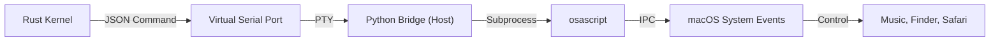

# Qai AgentOS: macOS & Siri Integration 🍎

> **Turning your Mac into an Agentic Powerhouse.**
> Qai isn't just a sandbox; it's a bridge to controlling your host macOS environment via natural language.

## 🌉 The Host Bridge Technology

Qai AgentOS runs inside a QEMU virtual machine for safety and isolation. However, through our specialized **Serial Bridge via PTY**, the "Neural Kernel" can reach out to the Host OS (macOS) to execute real-world actions.

### Architecture

### AppleScript (JXA)
The core enabler is **AppleScript** (and JXA - JavaScript for Automation). Qai agents generate optimized AppleScript payloads to:
-   **Control Media**: `tell application "Music" to play`
-   **Manage Files**: `tell application "Finder" to open home`
-   **Interact with UI**: `tell application "System Events" to keystroke...`

## 🧠 Siri Integration

We are positioning Qai as the "Brain" that Siri should have had.

### Current Implementation
-   **Media Handoff**: You ask Qai to "Play jazz", Qai instructs the Mac to start the Music app. You can then use standard Siri commands ("Next track") as they share the same system state.
-   **Spotlight Injection**: Qai can be triggered to perform searches or actions that populate Spotlight results.

### Future Vision: "Super Siri"
We are developing a **Shortcuts.app** integration layer.
1.  **"Hey Siri, ask Qai..."**: Trigger Qai workflows via voice from iPhone/Watch.
2.  **Intent Passing**: Pass the raw audio transcript from Siri -> Qai Bridge -> LangGraph Agent.
3.  **Action Execution**: Qai executes complex logic (e.g., "Summarize my last 5 emails and draft a reply") which Siri cannot do, then returns the result to Siri to speak out.

## 🔮 The "Agentic macOS" Vision

### From "App Icons" to "Intent Clusters"
Today, you hunt for an App Icon to solve a problem. 
-   Need to calculate? -> Calculator App.
-   Need to write? -> Notes App.

**Tomorrow with Qai**:
You state your **Intent**: *"Help me plan a budget for my trip."*
Qai instantly spawns a transient, ephemeral workspace combining:
-   Rows from your Numbers spreadsheet.
-   Prices from Safari search results.
-   A conversational interface for adjustment.

### The "Ghost in the Shell"
Qai aims to be the invisible layer over macOS.
-   **Self-Healing**: "Qai, my WiFi is flaky." -> Qai runs network diagnostics, flushes DNS, and restarts the interface.
-   **Semantic Filesystem**: "Qai, find that PDF about architecture I downloaded last week." -> Found based on vector similarity, not just filename.

## Supported macOS Capabilities (Alpha)

| Domain | Action | Natural Language Example |
| :--- | :--- | :--- |
| **Music** | Play/Pause/Skip | "Play my 'Focus' playlist." |
| **System** | Volume/Brightness | "Turn the volume up to 80%." |
| **Finder** | Open/Find | "Open my Downloads folder." |
| **Apps** | Launch/Quit | "Open Safari and go to GitHub." |
