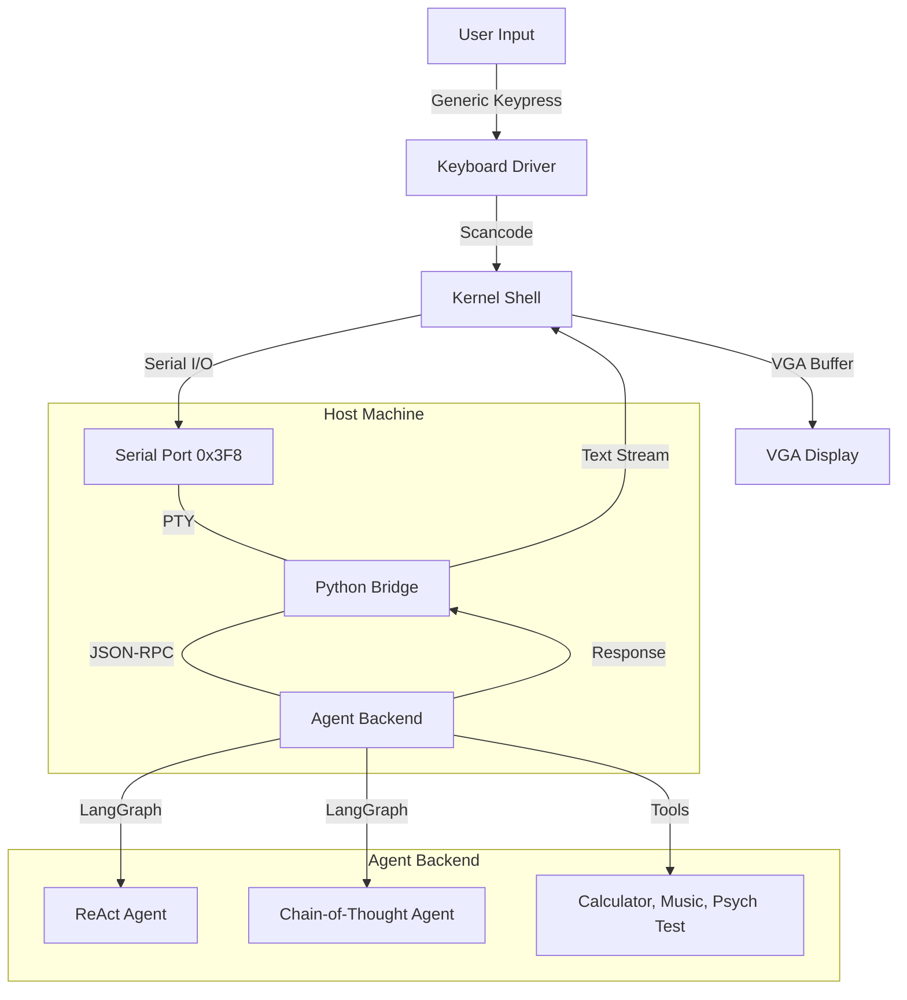
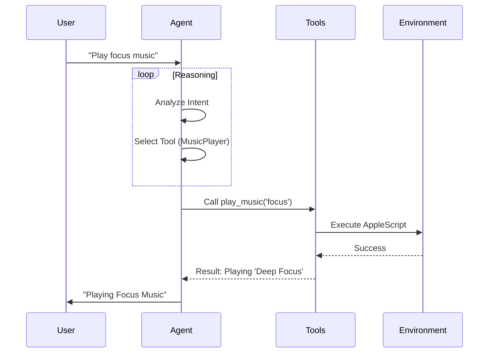

import { Mermaid } from 'astro-mermaid';

# System Architecture

Qai AgentOS is a hybrid system combining a high-performance **Rust Microkernel** with a flexible **Python Agent Brain**.

> [!NOTE]
> AgentOS is a hybrid kernel design that offloads intelligence to an external LLM "Cortex" while maintaining a minimal, safe Rust-based microkernel for hardware abstraction.

## High-Level Overview

The system is composed of three primary layers:
1.  **The Kernel (Rust)**: Handles hardware interrupts, VGA display, and serial I/O.
2.  **The Bridge (Python)**: Acts as the "Glue" between the QEMU-emulated hardware and the host AI models.
3.  **The Agent Backend (LangGraph)**: The "Brain" running on the host machine, executing complex cognitive workflows.

## Detailed Component Breakdown

### 1. The Kernel (`kernel/`)
A `no_std` Rust kernel booting via the `bootloader` crate.
-   **Entry Point**: `_start` in `main.rs`.
-   **Interrupts**:
    -   `Timer`: Ticks for potential scheduler (future).
    -   `Keyboard`: Captures scancodes, converts to ASCII using `pc-keyboard`, and pushes to a `crossbeam`-style queue.
-   **Task System**:
    -   `Executor`: Simple async executor polling tasks.
    -   `Shell Task`: Async task awaiting keystrokes and serial bytes.

### 2. The Bridge (`pty_echo_bridge.py`)
Connects QEMU's simulated serial port to the host's AI backend.
-   **Mechanism**: Creates a Pseudo-Terminal (PTY). QEMU redirects its serial output to this PTY.
-   **Protocol**:
    -   Raw text from Kernel -> printed to Host logs.
    -   Structured JSON commands from Kernel -> Parsed -> Sent to Agent.
    -   Text/Action from Agent -> Streamed byte-by-byte back to Kernel Serial.

### 3. The Agent Backend (`agent_backend/`)
The cognitive engine.
-   **Orchestrator**: Identifies intent (Natural Language vs Command).
-   **LangGraph Agents**:
    -   **ReAct**: Cyclic graph for tool use (Think -> Act -> Observe).
    -   **CoT**: Linear graph for deep reasoning (Step 1 -> Step 2 -> Output).
-   **Tools**:
    -   `MusicPlayer`: Controls macOS `Music.app` or `Spotify` via AppleScript.
    -   `PsychTest`: Runs the logic puzzles and SWOT analysis.

## Data Flow: "The Lifecycle of a Thought"

1.  **Input**: User types "Play some jazz" into the Kernel Shell.
2.  **Transmit**: Kernel buffers line, sends `{"type": "input", "content": "Play some jazz"}` via serial.
3.  **Bridge**: Python script reads PTY, detects JSON, triggers `agent_orchestrator`.
4.  **Think**:
    -   Orchestrator sees "Play music" intent.
    -   Routes to `MusicAgent`.
    -   `MusicAgent` (LangGraph) calls `AppleScriptTool`.
5.  **Act**: Host macOS starts playing jazz.
6.  **Feedback**: Agent generates response "Playing Jazz mix now."
7.  **Return**: Bridge streams "Playing Jazz mix now." back to PTY.
8.  **Display**: Kernel Serial interrupt receives bytes -> Shell Task wakes -> Prints to VGA.

## Core Logic (Sequence Diagram)

